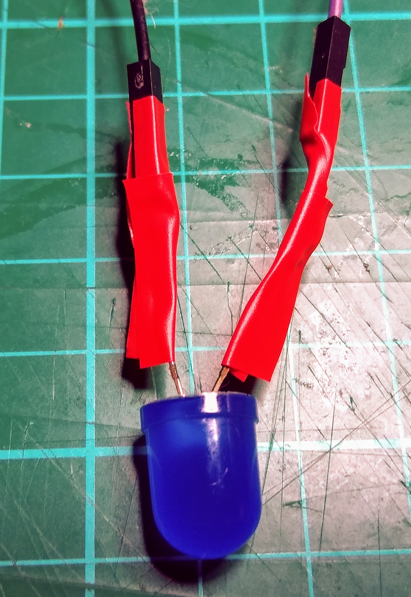

## Build your model

Now that you have an idea, it is time to build your model. Below are a few tips that might help you to produce the model you want.

--- collapse ---
---
title: Using a craft or utility knife
---

Craft and utility knives are very useful when making models, but you must be very careful when using them, as they are extremely sharp and can easily cause an injury. If you are using a craft or utility knife, make sure you have a responsible adult with you, or if you are not confident, ask them to do the cutting for you. It's also a good idea to use a cutting mat, to protect the surface you are working on, but a kitchen chopping board is a great alternative.

--- /collapse ---

--- collapse ---
---
title: Joining together jumper leads.
---

You might need extra-long leads to attach your LED to your Raspberry Pi pins. You can do this by "daisy chaining" leads together. For instance, to make an extra-long F-F lead, you can use a single M-F lead with another F-F lead.

The problem with this method is that often the leads will become detached from each other. It's often useful to use a small piece of tape to secure the connection.

--- /collapse ---

--- collapse ---
---
title: Short circuits
---

As the legs of the LEDs are often exposed, it is easy for them to touch each other, and create what is called a **short circuit**. This will stop your LED from working. A little bit of tape wrapped around each LED leg will prevent this from happening.

This will also help to keep the LED attached to it's jumper leads.

--- /collapse ---